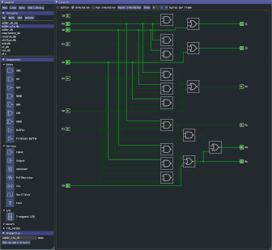

# LSim
LSim (or Logicial SIMulator) is a tool to simulate digital logic circuits. It's a hobby/toy project I started to help me learn about digital logic design.

Please note: if you're not into custom-built experimental logic simulators this might not be the place for you. For a motivation (or more accurately: a justification) why I build LSim please read this [document](docs/motivation.md).

## Features

- simulation logic circuits at the gate level
- a somewhat usable GUI to build and visualize digital circuits
- construct basic circuits a reuse them as buildings blocks for more complex circuits
- Python-bindings to enable easy exhaustive simulation of your circuit
- the Python-bindings also allow procedural generation of circuits (e.g. roms)
- can simulate basic digital circuits (e.g. flipflops and counters) and more complex circuits. As an example, LSim includes a simplistic 8-bit computer that can do some basic operations (e.g. compute the Fibonacci sequence).
- Runs on multiple platforms: Linux, Windows, MacOS X and using WebAssembly in most modern browsers. You can try a demo of the WebAssembly version over [here](http://justcode.be/lsim/). 

## Structure

The core of the project is a library called `lsim` . The library contains the logic simulator and the corresponding logic gates and supporting components. The library separates construction and modification of the digital circuit from the simulation of said circuit in a two-phased approach. 

In the first phase, a model of the circuit is constructed using basic components, nested circuits, and wires. The second phase instantiates a flattened, immutable representation of said model that is easier to simulate.

The library also contains the necessary support to store and load circuit models and preliminary Python bindings that allows easy scripting of circuit tests and procedural generation of large, repetitive circuits.

The GUI application, `lsim_gui`, wraps the library and provides an user interface to build circuits and visualize the circuit being simulated. 

## More information

- [Building](docs/building.md) LSim from source
- [Todo](docs/todo.md). LSim is a work-in-progress. This lists some major point left to tackle.
- How to use the [Python bindings](docs/using_python_bindings.md).
- A bit of documentation on how to use the [LSim GUI](docs/using_lsim_gui.md).

## License

This project is licensed under the 3-clause BSD License. See [LICENSE](LICENSE) for the full text.

## **Acknowledgments**

- The GUI is built with the awesome [Dear ImGui](https://github.com/ocornut/imgui). Building the cross-platform UI would not have been as much fun without it.
- I trust upon [pugixml](https://pugixml.org/) to save me from the horrors of parsing XML files.
- [Catch2](https://github.com/catchorg/Catch2) is the unit-test framework that, hopefully, saves me from making the same mistake twice. 
- [pybind11](https://github.com/pybind/pybind11) enabled me to add Python bindings without to much hassle.
- cute_files (part of [cute_headers](https://github.com/RandyGaul/cute_headers)) allows zipping around the filesystem on all supported platforms.
- Logisim (http://www.cburch.com/logisim/) for being part of the inspiration to start this project.
