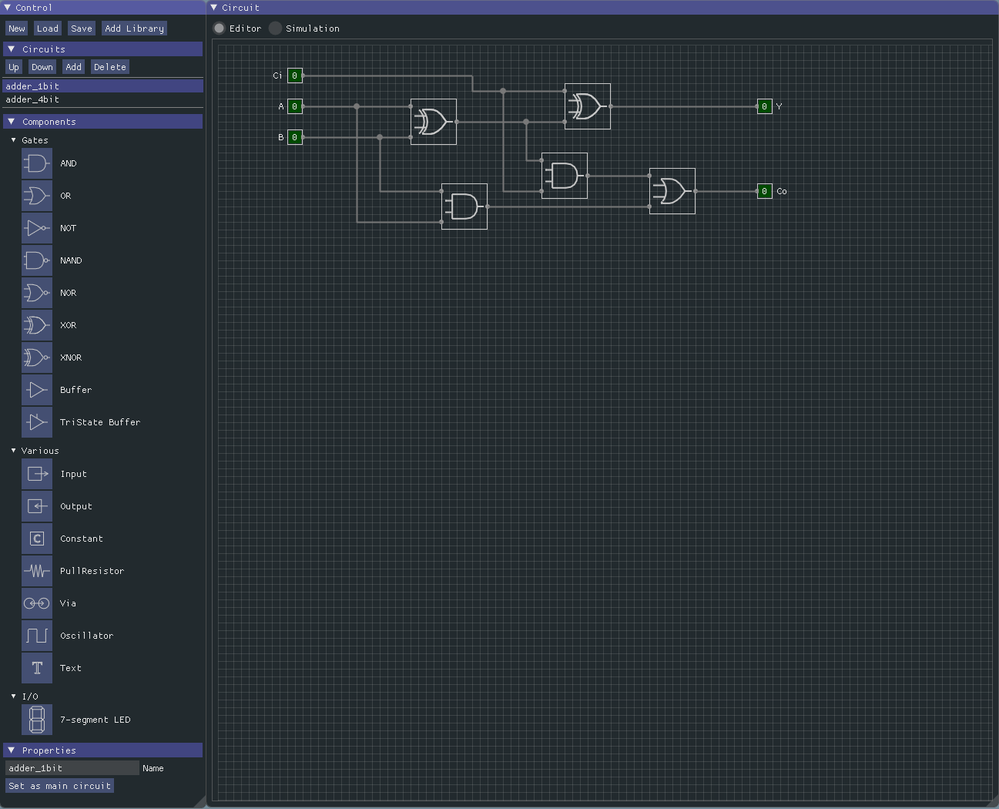

# Using the LSim GUI

When you open LSim you are greated with two windows: a "Control" window and a "Circuit" window. As the names imply the Control-window contains the interface elements to control the LSim circuit and the Circuit-windows is the canvas on which the circuit is built.

## Library control

Circuits are saved in circuit libraries. These files can be opened on there own or used as part of another circuit. The top part of the control panel is used for libraries:

- New: create a new, empty, circuit library
- Load: open a previously created circuit library
- Save: save the currently open circuit library. LSim will ask for a filename the first time a library is saved.
- Add Library: add a reference to an existing library to this library. The circuits in the referenced library can now be used in this circuit library.

## Circuit control

The next part of the control panel handles the circuits in the library. It shows a list of the circuits in the library and a few actions that can be used on them:

- Up: move the selected circuit up in the list
- Down: move the selected circuit down in the list
- Add: add a new circuit to the library
- Delete: delete the currently selected circuit. If it's not allowed to delete the current circuit, this button will be hidden.

## Component list

The next, and biggest, part of the control window is the component-panel. It lists the basic logic components and any circuits from referenced libraries. From here you can drag them onto the circuit editor to place them in the circuit. A short overview of the built-in, basic components:

* Gates:
  * AND: Output is high when all inputs (2-8) are high; otherwise output is low.
  * OR: Output is high when at least one of the inputs (2-8) is high; otherwise output is low.
  * NOT: Inverter with 1 input. Output is high when input is low; otherwise output is low.
  * NAND: Output is low when all inputs (2-8) are high; otherwise output is high.
  * NOR: Output is high when all inputs (2-8) are low; otherwise output is low.
  * XOR: Always 2 inputs. Output is high when one input is high and the other is low; otherwise output is low.
  * XNOR: Always 2 inputs. Output is low when one input is high and the other is low; otherwise output is high.
  * Buffer: Output is the same as the input. Basically a delay or signal amplifier.
  * TriState Buffer: Buffer with a control signal. When the control signal is low, the tristate buffer has no output signal (high impedance). When the control signal is high, the output is the same as the input.
* Various components:
  * Input: an input-connector allows signal to enter the circuit from an external source. Either from an encompassing circuit or by user control in the top-level circuit.
  * Output: an output-connector allows signals to exit the circuit.
  * Constant: Basically an input-connector that is always either low or high.
  * PullResistor: pulls the value of the connected node towards the specified value (low or high) when the node does not have a value yet.
  * Via: provides a connection between equally named via's in a circuit without actually drawing a wire between them. Useful to keep a circuit neat.
  * Oscillator: output toggles between high and low at the specified frequency.
  * Text: Allows a user to place commentary text in the circuit.
* I/O
  * 7-segment LED: a 7 segment LED (with decimal indicator) display. Behaves similarly to it's physical counterparts but the pin-out is slightly more ordered:
    *  Top row / left to right : top, top-right, bottom-right, bottom
    * Bottom row / left to right: bottom-left, top-left, on/off, middle, decimal point

## Property editor

The last part of the control window is the property window. It allows you to change the properties of the selected component or, if no component is selected, of the current circuit. It's content depends on the type of component is selected.

## The circuit editor

The top of the circuit editor allows you to switch between editor-mode and simulation mode. In simulation mode extra options are added to control the simulation. You can single-step through the simulation or let the simulation run at the specified speed.

The circuit can only be modified when in "Editor"-mode. You can add components to the circuit by dragging them from the control window. Other circuits from the opened library can be added to a circuit by right-clicking and selecting the wanted circuit from the list.

Select a component by left-clicking inside it's outline. One way to select multiple components is by simultaneously holding down shift on the keyboard when clicking components. You can also select multiple components through area-selection: left-click an empty area of the circuit and drag the mouse while holding down the left mouse button. All components inside the blue area will be selected upon release of the mouse button.

The little circles on the edge of the components are pins were wires can be connected to pass the signal from an output to an input pin. Hover over a pin and left-click after the yellow circle appears around the pin. Move the mouse cursor to the pin you want to connect to and left-click after the yellow circle appears. You can anchor the wire at a certain point and continue drawing in another direction by left-clicking on an empty spot of the circuit. To terminate the wire without connecting anywhere double-click.

To move a component select it and drag with the mouse until it is in the right spot. Moving a component disconnects any wires the were connected to it. After moving a component, pins that overlap a wire will automatically connect to that wire.

To delete components or wires, select them and press the delete key on the keyboard.

Copying and pasting is also supported by using Control-C and Control-V.